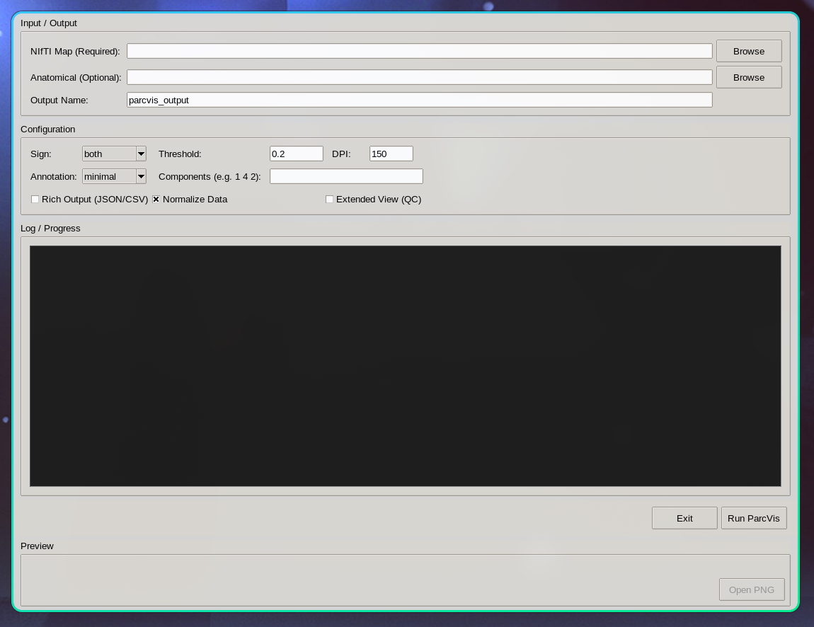
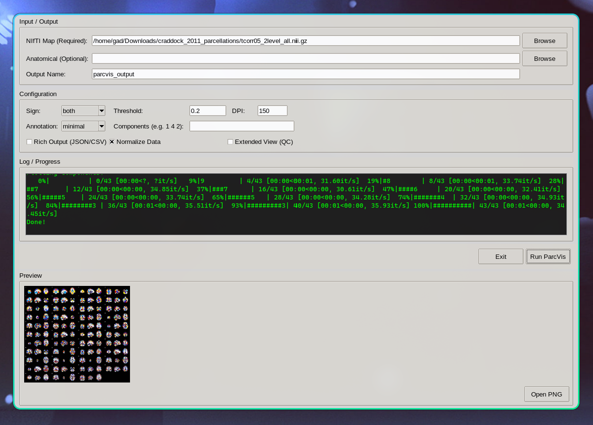
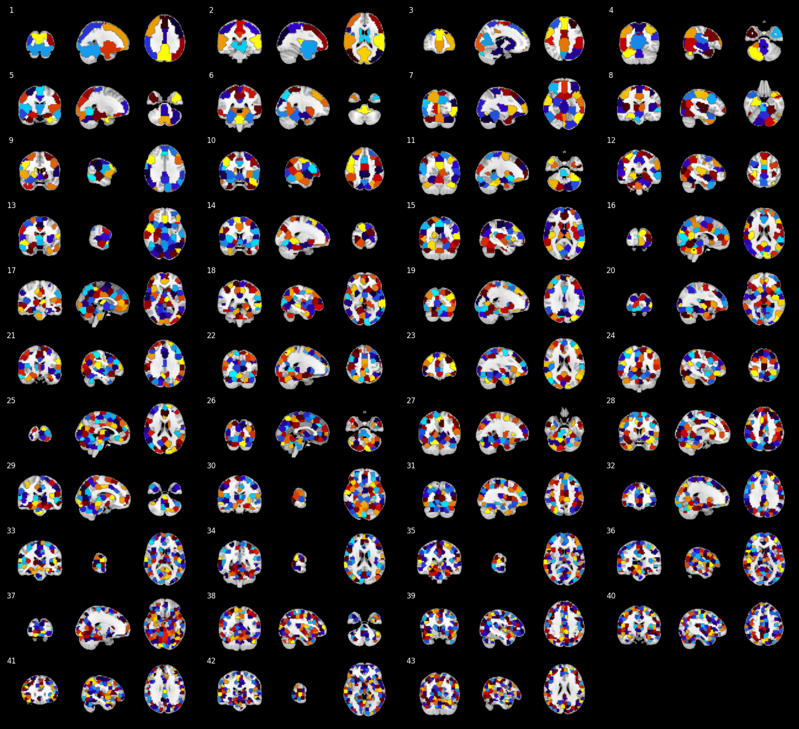

<div align="center">

<strong>GUI tool for brain parcellations visualization</strong>

</div>

## Installation
Follow these steps to set up a local environment and make sure ParcVis runs correctly. The GUI requires `tkinter`.

1) Create and activate a virtual environment (recommended)

Linux / macOS:

```bash
python3 -m venv .venv
source .venv/bin/activate
```

Windows (PowerShell):

```powershell
python -m venv .venv
.\.venv\Scripts\Activate.ps1
```

Windows (cmd.exe):

```cmd
python -m venv .venv
.\.venv\Scripts\activate.bat
```

2) Install Python dependencies

```bash
pip install -r requirements.txt
```

3) Confirm `tkinter` is available (platform notes)

- Linux (Debian/Ubuntu):

```bash
sudo apt update
sudo apt install python3-tk
```

- Fedora / RHEL / CentOS:

```bash
sudo dnf install python3-tkinter
```

- Arch

```bash
sudo pacman -S tk
```

- macOS:

tkinter is usually available in the system Python. If you installed Python via Homebrew, you may need to install and point to `tcl-tk`:

```bash
brew install tcl-tk
# then use the Homebrew Python from the same environment or follow Homebrew notes
```

- Windows:

The standard Python installer from python.org includes Tcl/Tk (tkinter). If you used a distribution without it, reinstall Python using the official installer and ensure the "tcl/tk and IDLE" option is selected.

4) Run ParcVis

From the project root with your virtualenv active:

```bash
python gui.py
```

## Usage

### Home screen



- Input / Output panel
	- NIfTI Map (Required): file picker for the 3D or 4D component map.
	- Anatomical (Optional): file picker for an underlay image (MNI template used if omitted).
	- Output Name: base name for saved files (default: `parcvis_output`).

- Configuration panel
	- Sign: dropdown (pos / neg / both) — controls whether only positive, only negative, or both polarities are shown and selects the colormap.
	- Threshold: numeric field that sets the minimum absolute value for component visualization.
	- DPI: integer field for PNG resolution.
	- Annotation: dropdown (none / minimal / full) — shows component indices and optionally cut coordinates on the figure.
	- Components: free-text field (e.g., `1 4 2`) to plot a subset; indices are 1-based.
	- Rich Output (checkbox): when enabled, ParcVis will also write a JSON config and a CSV of cut coordinates.
	- Normalize Data (checkbox): toggle normalization (centering and scaling) applied before plotting.
	- Extended View (checkbox): include additional rows in the output with separate underlay/overlay for QC.

- Buttons
	- Run ParcVis: starts processing (button is disabled during run to prevent concurrent jobs).
	- Exit: quits the GUI.
	- Log / Progress: scrolling console area that shows runtime messages and progress.


### Screen after producing an output using "Run ParcVis" button



- Preview: a downsampled inline PNG preview appears in the Preview panel.
- Open PNG: button becomes enabled — opens the full-resolution PNG in the system image viewer.
- Output files (saved to the same directory as the tool):
	- parcvis_output.png
	- parcvis_output.svg
	- parcvis_output_config.json (if Rich Output is enabled)
	- parcvis_output_cuts.csv (if Rich Output is enabled)

- On-screen behavior after a successful run:
	- A success dialog is shown and the console indicates completion.
	- The preview panel shows the generated image (if Pillow is installed) and the Open PNG button allows opening the high-resolution file.
	- If Annotation was set to `minimal` or `full`, component indices (and coordinates for `full`) are rendered on the figure.


## Example output


